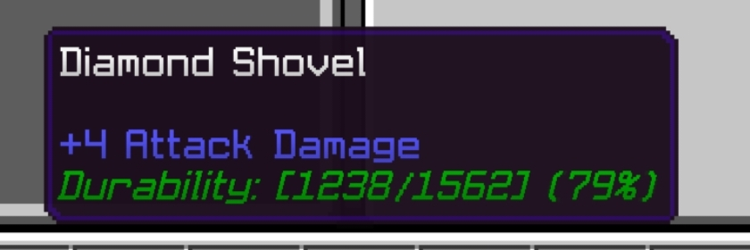

# ItemDurability Plugin

<p align="center">
  
</p>

[](https://opensource.org/licenses/MIT)
[](https://github.com/pmmp/PocketMine-MP)

## Description

**ItemDurability** is a PocketMine-MP plugin that displays item durability information in real-time within the item's lore (description). This plugin helps players see the remaining durability of weapons, tools, and armor, allowing them to know when to repair or replace them before they break.

## Preview



### Example Durability Color System

In-game, the durability text will automatically change colors based on the item's condition:

| Color | Sample | Durability Example | Condition |
|-------|--------|-------------------|-----------|
|  | Green | **Durability: [180/200] (90%)** | Very Good Condition |
|  | Dark Green | **Durability: [140/200] (70%)** | Good Condition |
|  | Yellow | **Durability: [100/200] (50%)** | Medium Condition |
|  | Gold | **Durability: [60/200] (30%)** | Low Condition |
|  | Red | **Durability: [30/200] (15%)** | Very Low Condition |
|  | Dark Red | **Durability: [10/200] (5%)** | Critical Condition |

## Features

- ✅ Displays item durability in a customizable format
- ✅ Updates durability information in real-time
- ✅ Supports all PocketMine-MP items with durability
- ✅ Optimized performance with an anti-spam update system
- ✅ Compatible with enchantment plugins and custom items
- ✅ No duplicate durability lore
- ✅ Automatic durability text color change based on percentage
- ✅ Support for displaying durability percentage
- ✅ Low durability warning color
- ✅ Color gradation system: Green → Dark Green → Yellow → Gold → Red → Dark Red

## Installation

1. Download the latest version from [GitHub Releases](https://github.com/ImmoDevs/ItemDurability/releases)
2. Place the `.phar` file in the `plugins` folder of your PocketMine-MP server
3. Restart the server
4. Edit the configuration file in `plugins/ItemDurability/config.yml` as needed

## Configuration

```yaml
# ItemDurability Configuration

# Durability display format
# %current% = current durability
# %max% = maximum durability
# %percent% = durability percentage
durability_format: "Durability: [%current%/%max%] (%percent%%)"

# Durability text color (default value: GREEN)
# Note: This color is only used as fallback if not using automatic color gradation
# The durability text color will automatically change based on durability percentage:
# 80-100% = GREEN (very good)
# 60-79% = DARK_GREEN (good)
# 40-59% = YELLOW (medium)
# 20-39% = GOLD (low)
# 10-19% = RED (very low)
# 0-9% = DARK_RED (critical)
durability_color: "GREEN"

# Show warning when durability is low
# Enable/disable low durability notifications
enable_low_durability_warning: true

# Percentage of durability considered low (%)
low_durability_percentage: 10

# Low durability warning color
low_durability_color: "RED" 
```

## Compatibility

- PocketMine-MP 5.0 or newer
- Compatible with enchantment, repair, and custom item plugins
- Does not interfere with other plugins that manipulate item lore

## FAQ

**Q: Does this plugin affect server performance?**  
A: No, the plugin is optimized for efficiency with a cooldown system and task scheduler.

**Q: Is this plugin compatible with other plugins?**  
A: Yes, it is designed to work with other plugins without conflicts.

**Q: How can I request new features?**  
A: Submit a feature request on [GitHub Issues](https://github.com/ImmoDevs/ItemDurability/issues) or contact the email below.

## License

This plugin is licensed under the [MIT License](https://opensource.org/licenses/MIT).

## Contact & Support

- **GitHub**: [ImmoDevs/ItemDurability](https://github.com/ImmoDevs/ItemDurability)
- **Discord**: [ImmoDevs Discord Server](https://discord.gg/immodevs)

## Tips and Best Practices

- **Custom Format**: You can customize the format to show only what you need. For example, if you only want to show percentage: `durability_format: "Durability: %percent%%"`
- **Server Performance**: The plugin has built-in anti-spam system to maintain optimal server performance
- **Integration with Other Plugins**: This plugin works well with enchantment and repair plugins
- **Color Customization**: If you prefer custom colors, you can disable the automatic color gradation in the config
- **Screenshots**: Take screenshots of your items with different durability levels to showcase the color system in your server's documentation

---

Copyright © 2025 ImmoDevs. All rights reserved.